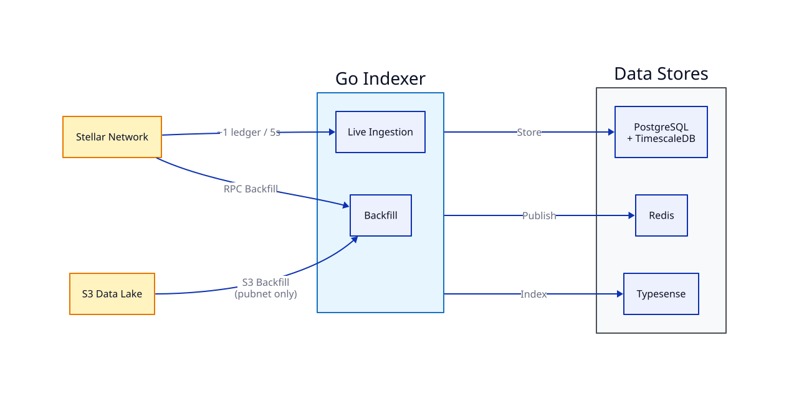

The indexer is a Go service that processes Stellar ledger data into local data stores for advanced queries, search, and analytics.



## Data Stores

| Store | Purpose |
|---|---|
| **PostgreSQL + TimescaleDB** | Structured ledger, transaction, and operation data with time-series optimizations |
| **Redis** | Pub/sub for real-time event distribution |
| **Typesense** | Full-text search across transactions, accounts, and assets |

## Ingestion Modes

### Live Ingestion

Processes new ledgers as they close (~1 every 5 seconds). Connects to a Stellar RPC endpoint and streams new data continuously.

```bash
make run-live
```

### Backfill

Two strategies for importing historical data:

- **RPC Backfill** — Fetches historical ledgers from an RPC endpoint. Works on any network.
- **S3 Data Lake Backfill** — Reads from Stellar's public S3 data lake. Pubnet only, significantly faster.

```bash
make backfill       # RPC backfill
make s3backfill     # S3 backfill (pubnet only)
```

## Architecture

The indexer follows a pipeline pattern: **Source → Transform → Store → Publish**.

## HTTP Read API

The indexer serves a frozen HTTP read API, separate from ingestion, that the explorer and TUI consume:

| Surface | Endpoints | Status |
|---|---|---|
| Analytics | `GET /api/v1/analytics/timeseries`, `GET /api/v1/analytics/top` | Live |
| Domains | `GET /v1/domains`, `GET /v1/domains/{name}` | Live |
| Contract verification | Not yet published | In development |
| DEX aggregates | Not yet published | In development |

Full request/response shapes are documented in the indexer repo: [`docs/analytics-api.md`](https://github.com/StellarViewOrg/indexer/blob/main/docs/analytics-api.md) and [`docs/domains-api.md`](https://github.com/StellarViewOrg/indexer/blob/main/docs/domains-api.md).

For full configuration options and setup instructions, see the [indexer README](https://github.com/StellarViewOrg/indexer/blob/main/README.md).
